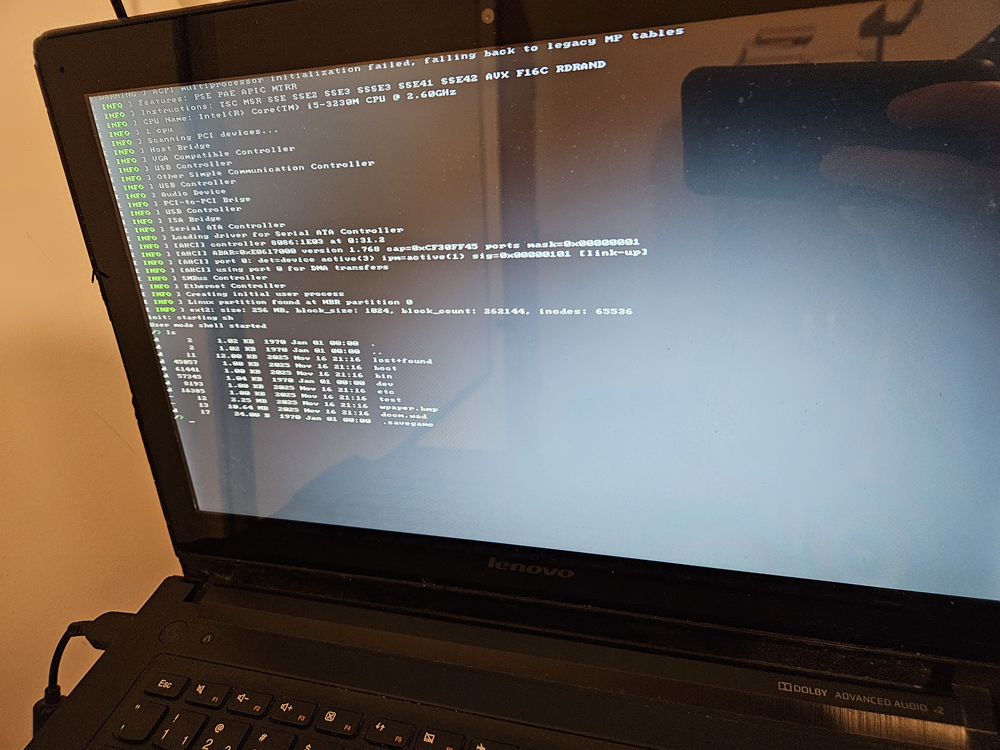
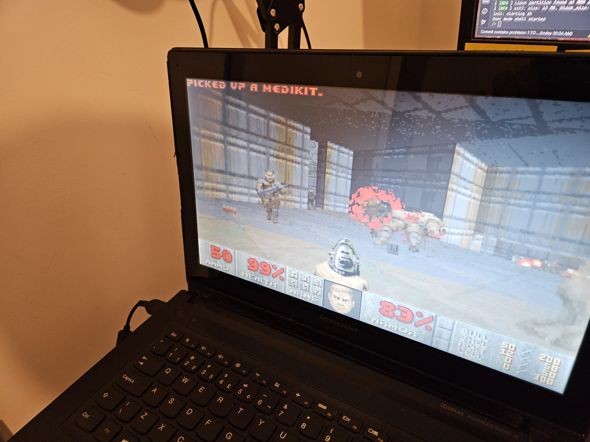
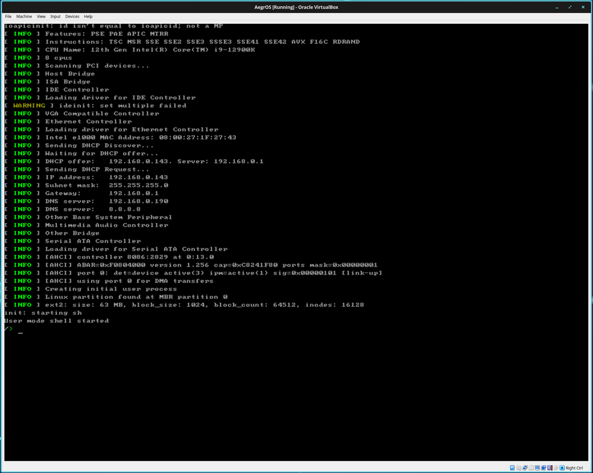
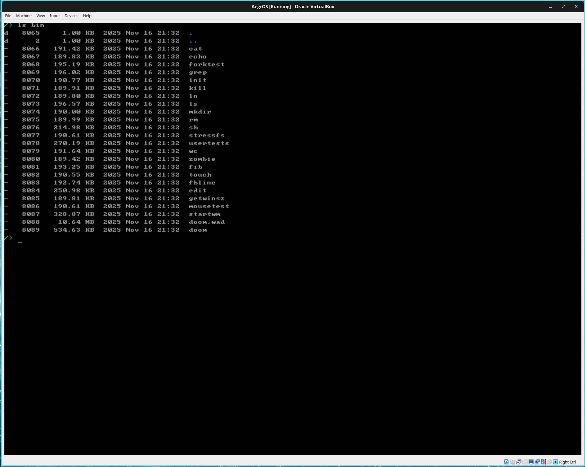
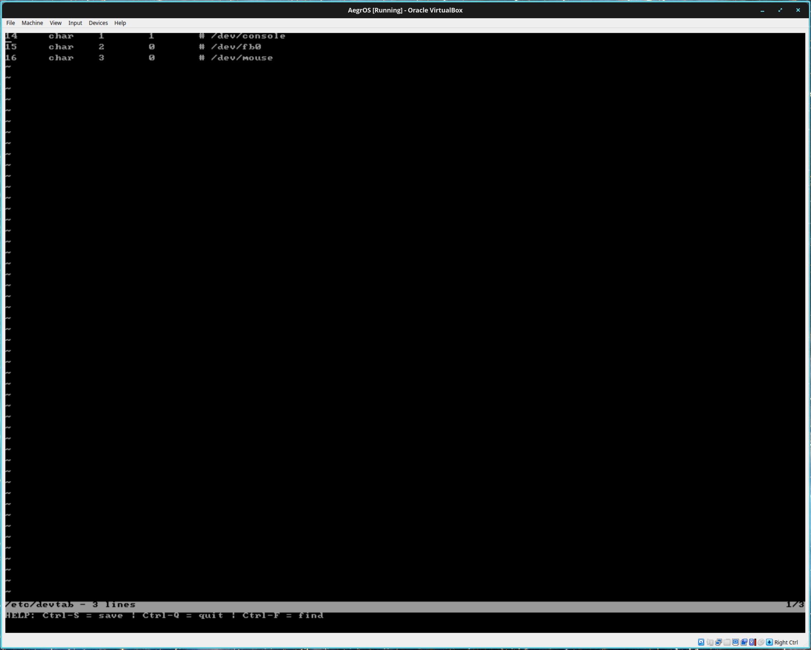
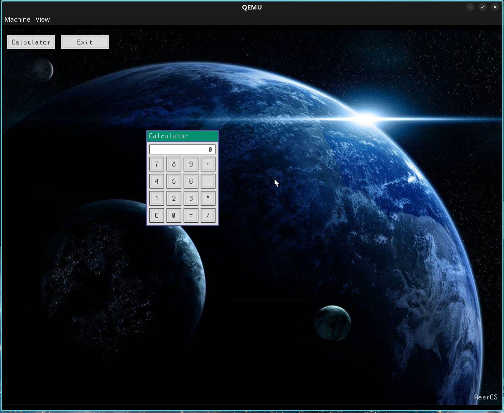
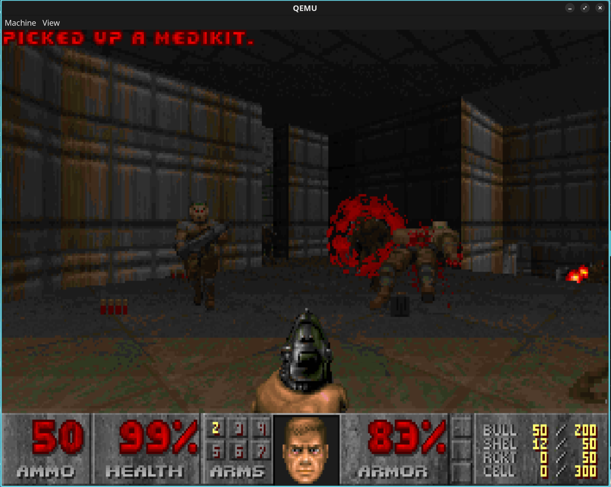
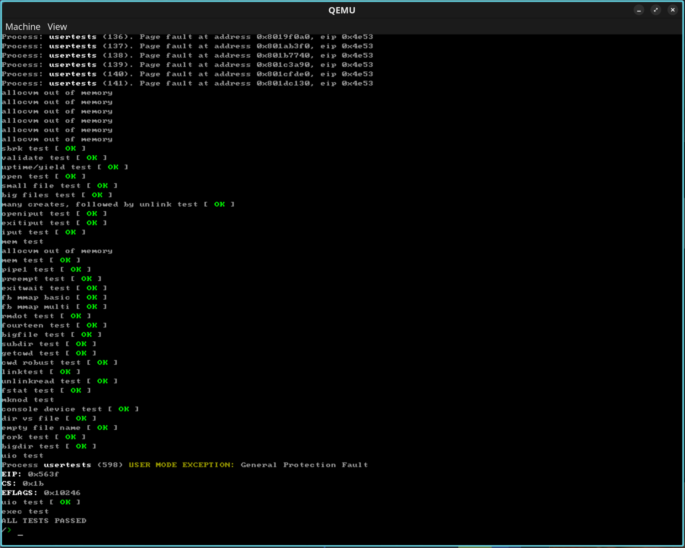
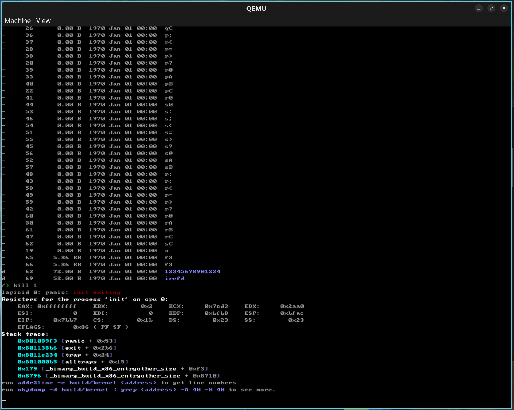
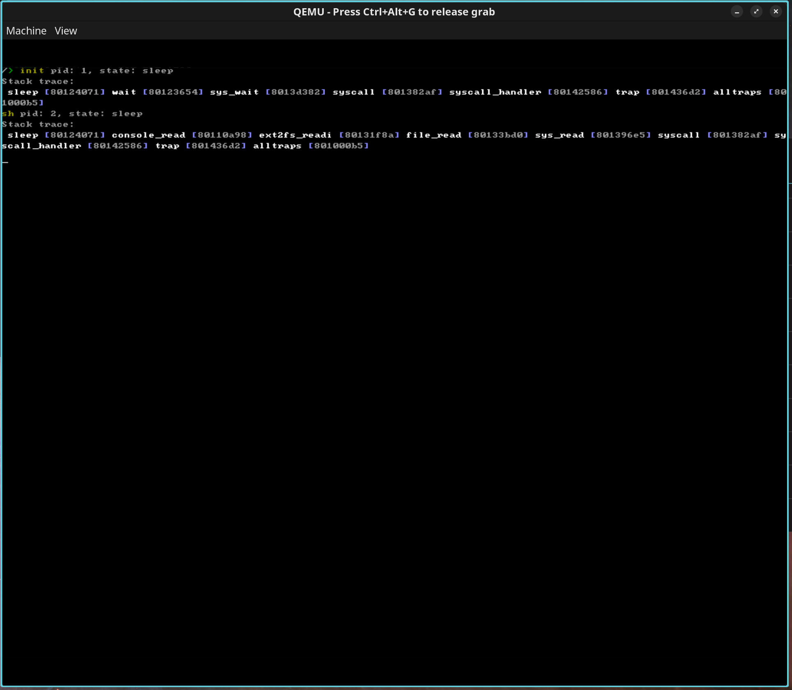

# AegrOS

*Just a random name, I don't care about it.*

Another hobby operating system I'm developing for fun.  
Written in C23, so it requires a version of GCC that supports it.  
It has been re-written a few times. On the last rewrite I used xv6 as a base.

## Documentation

[Cool things I learned](docs/COOL_THINGS_I_LEARNED.md)

Screenshots
  

## Roadmap

General features

- ✅ GRUB compatibility
- ✅ GDT
- ✅ TSS
- ✅ SSE2
- ✅ AVX
- ✅ Paging
- ✅ IDT
- ✅ ATA PIO
- ✅ AHCI
- ✅ e1000
- ✅ ext2
- ✅ MBR
- ✅ User mode
- ✅ Spinlock
- ✅ Sleeplock
- ⬜ Semaphore
- ✅ Multi-tasking
- ⬜ User mode multi-threading
- ✅ PS/2 Keyboard
- ✅ PS/2 Mouse
- ⬜ USB
- ✅ ELF loader
- ✅ Userland
- ✅ User shell
- ✅ Serial
- ☑️ libc (in progress)
- ✅ VGA text mode
- ✅ Framebuffer text mode
- ✅ PIT
- ✅ APIC
- ✅ Panic with stack trace
- ⬜ DWARF debugging
- ✅ Undefined behavior sanitizer
- ✅ Stack smashing protector
- ☑️ Network stack (in progress)
- ☑️ GUI (in progress)
- ✅️ It can run Doom!

     

Syscalls

- ✅ fork
- ✅ exec
- ✅ exit
- ✅ kill
- ✅ wait
- ✅ sleep
- ✅ yield
- ✅ getpid
- ✅ open
- ✅ close
- ✅ read
- ✅ write
- ✅ lseek
- ✅ fstat
- ✅ getcwd
- ✅ chdir
- ✅ reboot
- ✅ shutdown
- ✅ mmap
- ✅ munmap
- ✅ sbrk
- ✅ getkey
- ✅ open_dir
- ✅ dup
- ✅ pipe
- ✅ link
- ✅ unlink
- ✅ uptime
- ✅ tcgetattr
- ✅ tcsetattr
- ☑️ ioctl (in progress)
- ⬜ signal
- ⬜ sigaction
- ⬜ fcntl
- ⬜ socket
- ⬜ connect
- ⬜ bind
- ⬜ listen
- ⬜ accept
- ⬜ gettimeoftheday
- ⬜ clock_gettime
- ⬜ nanosleep
- ✅ time
- ✅ errno
- ⬜ pthread_create

